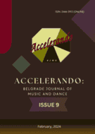

# Accelerando: BJMD, ISSUE 9

<!-- truncate -->

[Download full PDF](https://drive.google.com/file/d/1Z-nqlv5mdvejn3Rfc0zp0cHqb8_H54bK/view?usp=sharing)

### Challenges Of Globalization: Cultural Identity And Cultural Exchange

#### Artistic Dialogue Of Traditional Chinese Music And Western Approach In Choreography

Shengya Huang

[Read Online](/articles/issue9/artistic-dialogue-of-traditional-chinese-music-and-western-approach-in-choreography) [Download](https://drive.google.com/file/d/1QUdEHuXJ8QPc1ysUJJ7fw6pLbbzxiUUn/view?usp=sharing)

#### Turandot: The Half-Blood Princess

Tianrui Hu

[Read Online](/articles/issue9/turandot-the-half-blood-princess) [Download](https://drive.google.com/file/d/1wF-pIFko5cS4uFC8yJq7tJXhYFCYRfua/view?usp=sharing)

#### Music Performance Of Fela Anikulapo Kuti As An Environmental Justice Activist In Nigeria

Olusegun Stephen Titus, and Samuel A. Adejube

[Read Online](/articles/issue9/music-performance-of-fela-anikulapo-kuti) [Download](https://drive.google.com/file/d/1OCWEoOAF-VoQKotAa67ScH9lvWJ_LW16/view?usp=sharing)

#### Repositioning Afro-Pop In The Global Music Space: The Contributions Of Davido Music Worldwide (Dmw)’S 30 Billion Gang

Vincent Bamidele Omolaye

[Read Online](/articles/issue9/the-contributions-of-davido-music-worldwide) [Download](https://drive.google.com/file/d/1kJxxTendwqEejc0iugQRurN4duKLs2aO/view?usp=sharing)

#### Ethnic-Based Popular Music In Ekiti: A Study Of Elemure Ogunyemi’S Ere Ibile

Gbenga Oluwaseun Falana and Olusegun Stephen Titus

[Read Online](/articles/issue9/ethnic-based-popular-music-in-ekiti) [Download](https://drive.google.com/file/d/1oinwtcTCnHpMaf7RtjyO_g3FRby26Zw8/view?usp=sharing)

#### Cultural Influence Of The Odabara Dance On The Cultural Development Of Ikem Community, Isi-Uzo Local Government, Enugu State

Emmanuel Oyeunji Alemede and Akinbiola Oluwabusayo

[Read Online](/articles/issue9/cultural-influence-of-the-odabara-dance-on-the-cultural-development-of-ikem-community) [Download](https://drive.google.com/file/d/1NYlU_t-IMowjUdg0rJbrh-qyjKxoSQKr/view?usp=sharing)

### Movements And Sounds

##### Taxonomy Of Gesture-Sound Relationships In Manual Interactions With Imaginary Objects (Miio) In Hindustani Dhrupad Vocal Improvisation

Stella Paschalidou

[Read Online](/articles/issue9/taxonomy-of-gesture-sound-relationships) [Download](https://drive.google.com/file/d/1fXhK513b7La1MnwYwZWpco46V5ZFVtXI/view?usp=sharing)

#### The Synergy Of Music, Movement And Technology In The Author's Choreographies

Anna Galikowska-Gajewska

[Read Online](/articles/issue9/the-synergy-of-music-movement-and-technology) [Download](https://drive.google.com/file/d/1jMmRlyq2ZT99dsnCk2CIrip9G8Dyh1Zs/view?usp=sharing)

### Education – Pedagogy & Policy

#### Towards A Strategic Policy Formulation For Enhanced Music Directing And Ensemble Management In Nigeria

Oghenemudiakevwe Igbi and Ezinne Igbi

[Read Online](/articles/issue9/towards-a-strategic-policy-formulation-for-enhanced-music-directing-and-ensemble-management-in-nigeria) [Download](https://drive.google.com/file/d/1PJxdmrf1Gk5EYOSnBV54d_y8ckKkp6wT/view?usp=sharing)

#### Pedagogical Approach Towards Developing Early Childhood Music Education In Nigeria

Samuel Adeleke Joel

[Read Online](/articles/issue9/pedagogical-approach-towards-developing-early-childhood-music-education) [Download](https://drive.google.com/file/d/1_97Vlkm6Vbuxi3WwZvp30rOyqDrqyKgI/view?usp=sharing)

### Historical Overview

#### Links Between Dance And Music At The Time Of The Loss Of Polish Statehood Between 1795 And 1918

Klaudia Carlos-Machej

[Read Online](/articles/issue9/links-between-dance-and-music-at-the-time-of-the-loss-of-polish-statehood) [Download](https://drive.google.com/file/d/1-elx42On_RU-TbKeVTPAEVzkLcCUu1sh/view?usp=sharing)

#### The Contribution To The History Of The Ballet Of Serbian National Theater In Novi Sad: Rastislav Varga (1955-2021) [In Serbian]

Svenka Savić

[Read Online](/articles/issue9/rastislav-varga) [Download](https://drive.google.com/file/d/1qYXrzx3dwayKq8GW0mSQ5cHYJOR_BFYb/view?usp=sharing)
