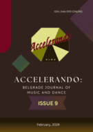

# Accelerando: BJMD, ISSUE 9

<!-- truncate -->

[Download full PDF]

### CHALLENGES OF GLOBALIZATION: CULTURAL IDENTITY AND CULTURAL EXCHANGE

#### ARTISTIC DIALOGUE OF TRADITIONAL CHINESE MUSIC AND WESTERN APPROACH IN CHOREOGRAPHY

Shengya Huang

[Read Online](/articles/issue9/artistic-dialogue-of-traditional-chinese-music-and-western-approach-in-choreography) [Download]

#### TURANDOT: THE HALF-BLOOD PRINCESS

Tianrui Hu

[Read Online](https://docusaurus.io) [Download]

#### MUSIC PERFORMANCE OF FELA ANIKULAPO KUTI AS AN ENVIRONMENTAL JUSTICE ACTIVIST IN NIGERIA

Olusegun Stephen Titus, and Samuel A. Adejube

[Read Online](https://docusaurus.io) [Download]

#### REPOSITIONING AFRO-POP IN THE GLOBAL MUSIC SPACE: THE CONTRIBUTIONS OF DAVIDO MUSIC WORLDWIDE (DMW)’S 30 BILLION GANG

Vincent Bamidele Omolaye

[Read Online](https://docusaurus.io) [Download]

#### ETHNIC-BASED POPULAR MUSIC IN EKITI: A STUDY OF ELEMURE OGUNYEMI’S ERE IBILE

Gbenga Oluwaseun Falana and Olusegun Stephen Titus

[Read Online](https://docusaurus.io) [Download]

#### CULTURAL INFLUENCE OF THE ODABARA DANCE ON THE CULTURAL DEVELOPMENT OF IKEM COMMUNITY, ISI-UZO LOCAL GOVERNMENT, ENUGU STATE

Emmanuel Oyeunji Alemede and Akinbiola Oluwabusayo

[Read Online](https://docusaurus.io) [Download]

### MOVEMENTS AND SOUNDS

##### TAXONOMY OF GESTURE-SOUND RELATIONSHIPS IN MANUAL INTERACTIONS WITH IMAGINARY OBJECTS (MIIO) IN HINDUSTANI DHRUPAD VOCAL IMPROVISATION

Stella Paschalidou

[Read Online](https://docusaurus.io) [Download]

#### THE SYNERGY OF MUSIC, MOVEMENT AND TECHNOLOGY IN THE AUTHOR'S CHOREOGRAPHIES

Anna Galikowska-Gajewska

[Read Online](https://docusaurus.io) [Download]

### EDUCATION – PEDAGOGY & POLICY

#### TOWARDS A STRATEGIC POLICY FORMULATION FOR ENHANCED MUSIC DIRECTING AND ENSEMBLE MANAGEMENT IN NIGERIA

Oghenemudiakevwe Igbi and Ezinne Igbi

[Read Online](https://docusaurus.io) [Download]

#### PEDAGOGICAL APPROACH TOWARDS DEVELOPING EARLY CHILDHOOD MUSIC EDUCATION IN NIGERIA

Samuel Adeleke Joel

[Read Online](https://docusaurus.io) [Download]

### HISTORICAL OVERVIEW

##### LINKS BETWEEN DANCE AND MUSIC AT THE TIME OF THE LOSS OF POLISH STATEHOOD BETWEEN 1795 AND 1918

Klaudia Carlos-Machej

[Read Online](https://docusaurus.io) [Download]

##### THE CONTRIBUTION TO THE HISTORY OF THE BALLET OF SERBIAN NATIONAL THEATER IN NOVI SAD: RASTISLAV VARGA (1955-2021) [In Serbian]

Svenka Savić

[Read Online](https://docusaurus.io) [Download]
