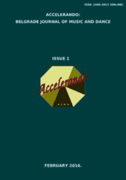

# Accelerando: BJMD, ISSUE 1

<!-- truncate -->

[Download full PDF](https://accelerandobjmd.weebly.com/uploads/6/9/5/0/6950835/accelerando_bjmd2016.pdf)

### Choreographic Approach in Modern and Contemporary Dance

#### Choreographic Methods for Creating Novel, High Quality Dance

David Kirsh, Dafne Muntanyola-Saura, R. Joanne Jao, Amy Lew, Matt Sugihara

[Read Online](/articles/issue1/choreographic-methods-for-creating-novel-high-quality-dance) [Download](https://drive.google.com/file/d/1-ANCb5gPjDUoZ41_9oW7ckX8leksxMd0/view?usp=sharing)

#### Differentiating Between Contemporary and Traditional Dance Aesthetics: Androgyny of Modern and Contemporary Dance

Vera Obradović

[Read Online](/articles/issue1/differentiating-between-contemporary-and-traditional-dance-aesthetic) [Download](https://drive.google.com/file/d/0B-3gNmXhRJqfUVpWZnJhVUk5WXc/view?usp=drive_link&resourcekey=0-CccB8-rlxM69XsTjuAOUDQ)

### Emeritus

#### The Single and Eternal Greece of Rallou Manou: A Survey of Her Work from a Slav Standpoint

Nadežda Mosusova

[Read Online](/articles/issue1/single-and-eternal-greece-of-rallou-manou) [Download](https://drive.google.com/file/d/1gNM-sdyPU1f-IQWN_W0yU1T0bA9DBC9x/view?usp=sharing)

### National ballet and music

#### The Cuban Dance Counstruct: A Mechanism for Creative Agency and Identity Formation

Elizabeth Gahl

[Read Online](/articles/issue1/the-cuban-dance-construct) [Download](https://drive.google.com/file/d/1FVRndJ0Q7KMfckf13juMhx4Pm-_s8tOL/view?usp=sharing)

#### Effects of Music and Dance on Society

Olena Kononova

[Read Online](/articles/issue1/genesis-of-kharkov-music-culture) [Download](https://drive.google.com/file/d/1nbfPQ2mWx9hY2ZNkn3JD93ZdIzSU4IfP/view?usp=sharing)

### Methodology and Pedagogy

##### Case Study of Student's Progress in Piano Playing: The Role of Training Model in Student's Expertise

Maja Marijan

[Read Online](/articles/issue1/the-role-of-training-model-in-piano-learning-and-teaching) [Download](https://drive.google.com/file/d/17gbslAgUXPZgrGZvpjtFeuKqOhhWzakW/view?usp=sharing)

#### Technique and Style of George Balanchine School

Petr A. Silkin

[Read Online](/articles/issue1/technique-and-style-of-george-balanchine-school) [Download](https://drive.google.com/file/d/1MbEVls7M1lGKBrwcl1kFGq2bAXdZGlwv/view?usp=sharing)

#### Expression of Music and Movement According to Emil Jacques-Dalcroze's Method [In Polish]

Anna Galikowska-Gajewska

[Read Online](/articles/issue1/russian-ballet-dancers-and-choreographers-at-the-belgrade-stage) [Download](https://drive.google.com/file/d/1WQ_1d6k2jPT37LTrq0X62de25UYLecjA/view?usp=sharing)

#### Utility of Simplified Labanotation

Maria del Pilar Naranjo

[Read Online](/articles/issue1/the-sound-in-movement) [Download](https://drive.google.com/file/d/1p1O8sDbbHfRSXcbxvMFgRkOIFawNwb0Q/view?usp=sharing)

### Bibliografical Survey And Historiography

#### The Beginnings of Music Criticism in Belgrade:​ ​ A Display of Musical Events Considered Through Reviews Published in the Daily Newspaper "Politika" 1904-1905 [In Serbian]

Dina Vojvodic

[Read Online](/articles/issue1/a-holistic-approach-to-issues-concerning-obesity-and-african-dance) [Download](https://drive.google.com/file/d/1XnAbUn61JkNdiUlC1kgrGoD1ncrNbdSL/view?usp=sharing)
