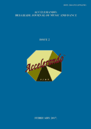

# Accelerando: BJMD, ISSUE 2

<!-- truncate -->

[Download full PDF](https://accelerandobjmd.weebly.com/uploads/6/9/5/0/6950835/issue_2_pdf.pdf)

### Pedagogy, Practice, Performance

#### The Self-Regulated Learning Model and Music Education

Maja Marijan

[Read Online](/articles/issue2/the-self-regulated-learning-model-and-music-education) [Download](https://drive.google.com/file/d/0B-3gNmXhRJqfMGNxQWFrblZpcTQ/view?usp=sharing&resourcekey=0-ECgc82thMP2QXBmLlWpBsg)

#### Music Teaching in Botswana Secondary Teacher Training Colleges: A Case of Molepolole College of Education

Otukile Sindiso Phibion, Fana Rabatoko and Shirley Marang Kekana

[Read Online](/articles/issue2/music-teaching-in-botswana) [Download](https://drive.google.com/file/d/0B-3gNmXhRJqfUVpWZnJhVUk5WXc/view?usp=drive_link&resourcekey=0-CccB8-rlxM69XsTjuAOUDQ)

#### Pole Dancing Auto-ethnography: Practice, Pedagogy, Performance

Amy Patricia Cadwallader

[Read Online](/articles/issue2/pole-dancing-auto-ethnography) [Download](https://drive.google.com/file/d/0B-3gNmXhRJqfbmdSdWdMR0NfbWc/view?usp=sharing&resourcekey=0-jcvD-9piQLNlNbw7PpXldA)

#### Modern Strategy in Dance Education [in Russian]

Natalia Sokovikova

[Read Online](/articles/issue2/modern-strategy-in-dance-education) [Download](https://drive.google.com/file/d/0B-3gNmXhRJqfT3Q4UGg1cF9lNGc/view?usp=drive_link&resourcekey=0-RZ-fekhktOO0r_DtDfTVgA)

### Effects of Music and Dance on Society

#### Reviews on Rzewski’s Leftist Political Piano Variations ​The People United Will Never Be Defeated

Deng Liang

[Read Online](/articles/issue2/rzewski-the-people-united-will-never-be-defeated) [Download](https://drive.google.com/file/d/0B-3gNmXhRJqfa0V6NE9lcW5Kak0/view?usp=sharing&resourcekey=0-5p7U4rc2DAT1EbfKsoBsjg)

### Gender and Identity in Music and Dance

#### Music Preference and the Issues of Social Challenges Among Nigerian Youth: Implications for Moral Development

Femi Abiodun

[Read Online](/articles/issue2/music-preference-among-nigerian-youth) [Download](https://drive.google.com/file/d/0B-3gNmXhRJqfZzBVZXJsS2VoYnc/view?usp=sharing&resourcekey=0-TbBD8K7A1Ej2sqHRkiXsIg)

### Artistic, Historical and Philosophical Inquiries

#### Poetry and Music of Medieval Azerbaijani Ashygs in the Context of Mystic Practices

Sanubar Baghirova

[Read Online](/articles/issue2/poetry-and-music-of-medieval-azerbaijani-ashygs) [Download](https://drive.google.com/file/d/0B-3gNmXhRJqfcWhQaFpSZk1yVXM/view?usp=drive_link&resourcekey=0-1tAIjRTUAeOLi9WvlMlQvA)

#### Russian Ballet Dancers and Choreographers at the Belgrade Stage in the 20th and Early 21st Centuries [In Russian]

Viktor Ivanovich Kosik

[Read Online](/articles/issue2/russian-ballet-dancers-and-choreographers-at-the-belgrade-stage) [Download](https://drive.google.com/file/d/0B-3gNmXhRJqfQndYOVdtbmxuMkk/view?usp=drive_link&resourcekey=0-tnNLXvAimkc7mvqe5vg5Mw)

#### The Sound in Movement Interpretation of the Selected Music Pieces by Debussy, Cage, Penderecki, Szalonek, Dobrowolski, Olczak, Kaiser

Anna Galikowska-Gajewska

[Read Online](/articles/issue2/the-sound-in-movement) [Download](https://drive.google.com/file/d/0B-3gNmXhRJqfR0hIQW0zb2tMQVk/view?usp=drive_link&resourcekey=0-hsp2S4wsI7775Aveqoi4-g)

#### No Simple Answers: A Holistic Approach to Issues Concerning Obesity and African Dance

Maxwell Xolani Rani

[Read Online](/articles/issue2/a-holistic-approach-to-issues-concerning-obesity-and-african-dance) [Download](https://drive.google.com/file/d/0B-3gNmXhRJqfeUZQVXFlbk4zVVU/view?usp=drive_link&resourcekey=0-wU8nQyI58j2bjAlrkss-lw)

### Reviews: Conference Reports

#### History and Perspectives of European Culture Development

Olena Kononova

[Read Online](/articles/issue2/history-and-perspectives-of-european-culture-development") [Download](https://drive.google.com/file/d/0B-3gNmXhRJqfZEJxOFA3STZQREk/view?usp=drive_link&resourcekey=0-6ZNTDSrXULhfhIg9KSRKZg)

#### Traditional and Contemporary in Art and Education: A Summary of the Scientific Meeting

Saša Božidarčević

[Read Online](/articles/issue2/traditional-and-contemporary-in-art-and-education) [Download](https://drive.google.com/file/d/0B-3gNmXhRJqfUG9xS05vTlh6UzA/view?usp=drive_link&resourcekey=0-yaIeWrzJJ2U1mBaEcEym-Q)
