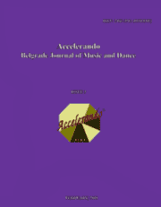

# Accelerando: BJMD, ISSUE 3

<!-- truncate -->

[Download full PDF](https://accelerandobjmd.weebly.com/uploads/6/9/5/0/6950835/accelerando_bjmd_issue_3.pdf)

### Music Related Issues

#### Control and Chance in Music and Art: A Survey of Philosophies

Shuang Cai

[Read Online](/articles/issue3/control-and-chance-in-music-and-art) [Download](https://drive.google.com/file/d/1eVAqJF-I5D-yXgTJgEahwsAYfP2Vn6CK/view)

#### "Junction +4": A Foray into the Intersection of Minimalism and Indeterminacy

Matthew Glenn Quick

[Read Online](/articles/issue3/the-intersection-of-minimalism-and-indeterminacy) [Download](https://drive.google.com/file/d/1CMcpDxHPXpUXiRRN7JQhJERn5Ymb_OYl/view?usp=sharing)

#### The Categorical Perception Of The Music Scale: A Challenge Before The Microtonal Music

Ivan Kostadinov Yanakiev

[Read Online](/articles/issue3/the-categorical-perception-of-music-scale) [Download](https://drive.google.com/file/d/1NYV-oxARIwhoy-XtcsNt2o_HRy-ZEe3u/view?usp=sharing)

#### The Perception and Organization of Time in Music

Maja Marijan

[Read Online](/articles/issue3/the-perception-and-organization-of-time-in-music) [Download](https://drive.google.com/file/d/19d1Nux48cCJu-NdkEeqWlmlgCloJ6crr/view?usp=sharing)

#### Music, Myths And Rituals: Traditional Societies Of African Lobi Peoples And Environmental Issues [In French]

Hien Sié

[Read Online](/articles/issue3/traditional-societies-of-african-lobi-peoples-and-environmental-issues) [Download](https://drive.google.com/file/d/1b4pS7Q_-de0hiZvJ2L2tirWBAURjSdVc/view?usp=sharing)

### Gender and Identity in Music and Dance

##### Dance Music: Gender Issues and Embodiment of National Identity [In Russian]

Natalia Viktorovna Sokovikova​

[Read Online](/articles/issue3/function-and-structure-of-yoruba-songs-on-dental-health) [Download](https://drive.google.com/file/d/1VgEw2FExvPw6Gnbw-fuaDFFi4H8t9l1_/view?usp=sharing)

#### Ballet for Children at the Serbian National Theatre in Novi Sad (1972-2017) [In Serbian]

Svenka Savic

[Read Online](/articles/issue3/function-and-structure-of-yoruba-songs-on-dental-health) [Download](https://drive.google.com/file/d/1T2tJFqkXT6aonjb-e7m11lFWkKP3GcMM/view?usp=sharing)

### Modern Dance in Serbia

#### Maga Magazinovic: The Main Concepts Of Modern Dance

Milos Marijan

[Read Online](/articles/issue3/function-and-structure-of-yoruba-songs-on-dental-health) [Download](https://drive.google.com/file/d/18v9RwgZd0taqrB-CEEEgm6gP3l4Km_s4/view?usp=sharing)

#### Smiljana Mandukic (1908-1992): Beginning of Modern Dance and Dance Expressionism in Europe

Vera Obradovic

[Read Online](/articles/issue3/function-and-structure-of-yoruba-songs-on-dental-health) [Download](https://drive.google.com/file/d/1Qzc8wgBtxHM1zJiDmBw2mvdZ1wt68QhV/view?usp=sharing)

### Dance Injury

#### Lower Limb Flexibility and Risk of Injury in Professional Dancers: A comparative study of Ballet, Hip-Hop and African traditional dances

Aiyegbusi Ayoola Ibifubara, Odebiyi Daniel Olufemi, and Udegbeh Otito Stephen

[Read Online](/articles/issue3/function-and-structure-of-yoruba-songs-on-dental-health) [Download](https://drive.google.com/file/d/1mFiqU9JxWNpdB_Vd3r_wAiiGWFc8cx8R/view?usp=sharing)
