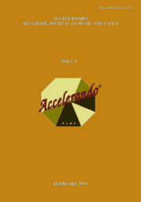

# Accelerando: BJMD, ISSUE 4

<!-- truncate -->

[Download full PDF](https://accelerandobjmd.weebly.com/uploads/6/9/5/0/6950835/accelerando_issue4_2019.pdf)

### Music and Society

#### MUSICAL FRAMEWORK: A SOCIOCULTURAL APPROACH [In Serbian]

Maja Marijan

[Read Online](/articles/issue4/sociocultural-approach-to-music) [Download](https://drive.google.com/file/d/1__zTaV_aeQppEIqgvZWw9SnG1uFVzHZG/view?usp=sharing)

#### CASE STUDY: POPULARIZING MUSIC ON FILM (MARLEY DOCUMENTARY) [In Serbian]

Snežana Cvijanović

[Read Online](/articles/issue4/popularizing-music-on-film) [Download](https://drive.google.com/file/d/1420xLxphlhH4KoYuUay1rwhyMRO9_NtB/view?usp=sharing)

### Music and Dance Pedagogy

#### CHOIR MANAGEMENT IN NIGERIAN SCHOOLS: CONSEQUENCES OF PEDAGOGICAL METHODS

Femi Abiodun

[Read Online](/articles/issue4/choir-management-in-nigerian-schools) [Download](https://drive.google.com/file/d/1kkQaPttQqTn2RpNxKTBJ4ye_WQa7vPE1/view?usp=sharing)

#### MOVEMENT INTERPRETATION OF MUSIC IN EURHYTHMICS: APPROACH TO MOVEMENT INTERPRETATION IN MUSIC EDUCATION IN POLAND

Anna Galikowska-Gajewska

[Read Online](/articles/issue4/approach-to-movement-interpretation-in-music-education-in-poland) [Download](https://drive.google.com/file/d/1Gxyn1XavkO4IJweTmBAMe-06W2YDn1el/view?usp=sharing)

#### INTERPRETATION OF MOTORIAL MUSIC IN THE RHYTHMIC METHOD OF EMIL JAQUES-DALCROZE [In Polish]

Anna Galikowska-Gajewska

[Read Online](/articles/issue4/rhythmic-method-of-emil-jaques-dalcroze) [Download](https://drive.google.com/file/d/1zDwGqaNaIKvckMu-Xqz5TNIwqoffZEG2/view?usp=sharing)

### Medical Ethnomusicology

##### FUNCTION AND STRUCTURE OF YORUBA SONGS ON DENTAL HEALTH AMONG THE NURSING MOTHERS IN SOUTHWESTERN NIGERIA

Olusegun Stephen Titus and Olufemi Elijah Oyetola​

[Read Online](/articles/issue4/function-and-structure-of-yoruba-songs-on-dental-health) [Download](https://drive.google.com/file/d/1FtekTfUYQ4VgYpUe5C97Jn71a_WIBEVs/view?usp=sharing)
