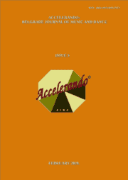

# Accelerando: BJMD, ISSUE 5

<!-- truncate -->

[Download full PDF](https://accelerandobjmd.weebly.com/uploads/6/9/5/0/6950835/accelerandobjmd_issue-5_2020.pdf)

### Composers and Performers

#### THE ANALYSIS OF KLEMPERER’S INTERPRETATION OF BEETHOVEN’S "EROICA"

Xingxing Wang and Richard Pohl

[Read Online](/articles/issue5/analysis-of-klemperers-interpretation-of-eroica) [Download](https://drive.google.com/file/d/1xF0jk-0mBmT6tYdQ0b1yhgDVpv-PG_o4/view?usp=sharing)

#### THE MUSICAL STYLE OF ELLIOTT CARTER: THE ANALYSIS OF THE PIANO SONATA (1945-46)

Yingying Wang

[Read Online](/articles/issue5/musical-style-of-elliott-carter) [Download](https://drive.google.com/file/d/1iob5Hz9QkG3yOTpDt-N9p61y9X28JX56/view?usp=sharing)

#### MEI-FANG LIN AND HER COMPOSITIONAL STYLE: ANALYISYS OF TWO SOLO PIANO PIECES "DISINTEGRATION" AND "MISTRESS OF THE LABYRINTH"

Yingying Wang

[Read Online](/articles/issue5/mei-fang-lin-and-her-compositional-style) [Download](https://drive.google.com/file/d/1_MeSbqzTxXUBOhPGDGK87FQyg00sAYWJ/view?usp=sharing)

#### GUITAR WRITING BY NON-GUITARIST COMPOSERS AND ARRANGERS 

Viana Andersen

[Read Online](/articles/issue5/exploring-differences-in-piano-teaching-between-the-united-states-and-china) [Download](https://drive.google.com/file/d/1Nu9EgUYS4Ttiq9PKc5gKdJ64IuUOF6Zm/view?usp=sharing)

### Clinical and Environmental Musicology

#### THE ROLES OF YORUBA SONGS AMONG THE PREGNANT WOMEN ATTENDING ANTENATAL CLINICS IN SOUTHWESTERN NIGERIA 

Olusegun Stephen Titus

[Read Online](/articles/issue5/principles-of-piano-teaching) [Download](https://drive.google.com/file/d/1gf2c7m1nyaFCWmTZpuXpmhgg0IVBfdhm/view?usp=sharing)

### Ballet History

##### BALLET SCENE IN BELGRADE (1930-1940) [In Russian]

Viktor Ivanovich Kosik

[Read Online](/articles/issue5/foreign-studies-of-the-serbian-composers) [Download](https://drive.google.com/file/d/1-X2kVQio2WorLdjDN3rMRyP5trUnGQdk/view?usp=sharing)
