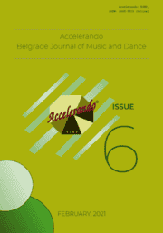

# Accelerando: BJMD, ISSUE 6

<!-- truncate -->

[Download full PDF](https://drive.google.com/file/d/1eaPKXv5whavIu8-pm38_wWYP_n1KYbHK/view?usp=sharing)

### The Relationship Between Music and Words

#### ANALYSIS OF SELECTED ONDO TRADITIONAL SONGS AS CARRIERS OF CULTURAL LEGACIES:​ EXTRAPOLATING CULTURE FROM SONG TEXTS

Olusakin Oluniyi​

[Read Online](/articles/issue6/analysis-of-selected-ondo-traditional-songs) [Download](https://drive.google.com/file/d/17gZh1sBynw5c6Z8r9PAKVzmIqplhsSfL/view?usp=sharing)

#### JULIET CHARACTER ANALYSIS IN THE OPERA ​“I CAPULETI E I MONTECCHI” [IN ITALIAN]

Yangyang Tang

[Read Online](/articles/issue6/code-mixing-in-nigerian-gospel-music) [Download](https://drive.google.com/file/d/141DWZ5CDNVdGX1OFap3CmGgvnHbr8NBS/view?usp=sharing)

#### THE WORDS AND MUSIC OF DICHTERLIEBE 

Xin Shao

[Read Online](/articles/issue6/the-words-and-music-of-dichterliebe) [Download](https://drive.google.com/file/d/1CZ3g7NT5krtC_sNZisFHnxHTFuISFgB2/view?usp=sharing)

### Piano Teaching: Differences and Principles

#### EXPLORING DIFFERENCES IN PIANO TEACHING BETWEEN THE UNITED STATES AND CHINA 

Xueli Liu

[Read Online](/articles/issue6/exploring-differences-in-piano-teaching-between-the-united-states-and-china) [Download](https://drive.google.com/file/d/1wnXb7oMfAPOdJ14QumMBb9VtklRSHW25/view?usp=sharing)

#### PRINCIPLES OF PIANO TEACHING: INTRODUCING A NEW PIECE TO A STUDENT 

Mareli Mostert

[Read Online](/articles/issue6/towards-theory-of-supplicative-musicology) [Download](https://drive.google.com/file/d/1gO-i5Z80tNBnMfatSngSHtLmcHsT4AUG/view?usp=sharing)

### An Addition to the History of Serbian Music

##### FOREIGN STUDIES OF THE SERBIAN COMPOSERS CRUCIAL IN FORMING NATIONAL MUSIC CULTURE

Nadežda Mosusova

[Read Online](/articles/issue6/amaqghira-as-a-dancer-singer-and-drummer) [Download](https://drive.google.com/file/d/1FeZodb_11z_K3zVztCMJ4uVjXgCQQ2fs/view?usp=sharing)
