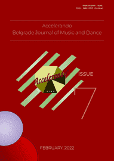

# Accelerando: BJMD, ISSUE 7

<!-- truncate -->

[Download full PDF](https://drive.google.com/file/d/1KW8qy5aR-ZXVotx9yq5ou6Cjqs5gNDnz/view?usp=sharing)

### The Role of Music in Africa

#### ANATOMY OF ETHOS, PATHOS IN MUSIC OF AFRICA ​AND ITS PATHOGENIC ESSENCE

Charales O. Aluede and Olatubosun S. Adekogbe

[Read Online](/articles/issue7/anatomy-of-ethos-pathos-in-music-of-africa) [Download](https://drive.google.com/file/d/1X8R0QBdJAL0pTDo3hjlJtgr0mIs9l0Aq/view?usp=sharing)

#### THE IMPACT OF THE USE OF CODE-MIXING IN NIGERIAN GOSPEL MUSIC

Emmanuel Oyetunji Alemede

[Read Online](/articles/issue7/code-mixing-in-nigerian-gospel-music) [Download](https://drive.google.com/file/d/1kopQWN7dXc6-Czlarqyp9UjSwl0mDQSn/view?usp=sharing)

#### AN EXCURSION INTO THE ROLE OF MUSIC IN COPING WITH ​BEREAVEMENT IN ESAN, EDO STATE OF NIGERIA

Charles Onomudo Aluede

[Read Online](/articles/issue7/the-role-of-music-in-coping-with-bereavement-in-esan) [Download](https://drive.google.com/file/d/1CZ3g7NT5krtC_sNZisFHnxHTFuISFgB2/view?usp=sharing)

### Dance Education in India

#### AN EMPIRICAL RESEARCH: INDIAN CLASSICAL DANCE EDUCATION AND ITS IMPACT ON THE STUDENTS' SPIRITUAL INTELLIGENCE

Kanaka Subramaniam  and Sujatha Mohan

[Read Online](/articles/issue7/indian-classical-dance-education-and-its-impact) [Download](https://drive.google.com/file/d/1a7lww6988TPsP0h2JXHFra9CDeCkD7eA/view?usp=sharing)

### MusicAl Analysys

#### STUDY OF SOME NIGERIAN ART MUSIC COMPOSITIONS: TOWARDS A THEORY OF SUPPLICATIVE MUSICOLOGY

Kayode Morohunfola

[Read Online](/articles/issue7/towards-theory-of-supplicative-musicology) [Download](https://drive.google.com/file/d/1U1sip3BA3Zj5NQ79zH-HjQKnnTOWE77V/view?usp=sharing)

#### MUSICAL TRACK ANALYSYS OF CHRISTIE ESSIEN IGBOKWE “IFE”

Emmanuel Oyetunji Alemede

[Read Online](/articles/issue7/musical-track-analysys-of-christie-essien-igbokwe-ife) [Download](https://drive.google.com/file/d/1DSBA1rzOybVvmYDNsccmhVmeNFRF4eZn/view?usp=sharing)

### The Synthesis of the Arts – Ceremonial Rituals in Africa

##### AMAQGHIRA AS A DANCER, SINGER AND DRUMMER

Benjamin Obeghare Izu and Alethea de Villiers

[Read Online](/articles/issue8/amaqghira-as-a-dancer-singer-and-drummer) [Download](https://drive.google.com/file/d/1ii0ROpBko2GZreu-w2wm76z5ssoNNW8e/view?usp=share_link)

#### COMPARING TORU TAKEMITSU’S MUSICAL LANGUAGE TO MESSIAEN AND DEBUSSY

Hai Jin

[Read Online](/articles/issue7/comparing-toru-takemitsu-musical-language-to-messiaen-and-debussy) [Download](https://drive.google.com/file/d/1I0XE75mv9oTkga7kvMJGhgOl-pXbR7Cm/view?usp=sharing)

### Classical Dance History

#### IRINA BARONOVA (1919 - 2008): THE STAR OF RUSSIAN BALLET [In Russian]

Nikolay Vitsyn

[Read Online](/articles/issue7/irina-baronova-the-star-of-russian-ballet) [Download](https://drive.google.com/file/d/13haIWzTFabw3o45Y74Lt-_cJc70qGE-V/view?usp=sharing)
