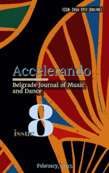

# Accelerando: BJMD, ISSUE 8

<!-- truncate -->

[Download full PDF](https://drive.google.com/file/d/1pW2P9-IXzuceq7sVoAzae9Aev72tKwoj/view?usp=sharing)

### Postgraduate Music Education in Nigeria

#### ANNOTATED BIBLIOGRAPHY OF DOCTORATE DEGREE ​MUSIC THESES IN NIGERIA (2011-2021)

Oghenemudiakevwe Igbi, Dafe Bruno Ekewenu, and Charles Onomudo Aluede

[Read Online](/articles/issue8/annotated-bibliography-nigeria) [Download](https://drive.google.com/file/d/1g-coZuyWZh55Iioq_wYvwDU2JHOkih3g/view?usp=share_link)

### Music and Meaning

#### MUSICO-METAPHOR: ​THE MAN IN THE LONG BLACK COAT

Emmanuel Oyetunji Alemede, Gbenga Oni and Adeyemo Adetayo

[Read Online](/articles/issue8/the-man-in-the-long-black-coat) [Download](https://drive.google.com/file/d/1taYv9kAc7PRAjv3brVU0bgOg2xcb0j6m/view?usp=share_link)

### Indigenous Culture - Preserving and Revitalizing the Yoruba Heritage

#### AESTHETICS AND UTILITARIAN ESSENCE ​OF SELECTED YORÙBÁ FOLKTALES

Bamidele Omolaye

[Read Online](/articles/issue8/aesthetics-of-selected-yoruba-folktales) [Download](https://drive.google.com/file/d/1sRtg3Bm74mBkXnv_mOK2OyeAcK-LaoPd/view?usp=share_link)

#### FOLK SONGS AS AN AGENT OF CULTURAL TRANSMISSION, ​TEACHING AND LEARNING FOR A YORUBA CHILD

Ikumapayi Abayomi Ayoola

[Read Online](/articles/issue8/yoruba-folk-songs-teaching-and-learning) [Download](https://drive.google.com/file/d/1fKLaIXZLQ6dVPekNlmMcrBBfBTUN6-M-/view?usp=share_link)

#### SOUNDSCAPE ON “ÀPARÒ"(PARTRIDGE) AND ITS ​ECO PROVERBIAL IMPLICATIONS IN YORUBA WORLDVIEW

Olatunbosun Samuel Adekogbe

[Read Online](/articles/issue8/soundscape-on-aparo) [Download](https://drive.google.com/file/d/1_vXQ-dIDTqYbyndfYLN6Vnx7uoIUlrRO/view?usp=share_link)

#### TOWARDS REVITALISATION OF YORUBA FOLK OPERA ​FOR PRESERVATION OF YORUBA CULTURE

Sunday Olufemi Akande

[Read Online](/articles/issue8/towards-revitalisation-of-yoruba-folk-opera) [Download](https://drive.google.com/file/d/1r_OtKTYbBBj-QHJNLwcVUGIv7998SC6z/view?usp=share_link)

### The Synthesis of the Arts – Ceremonial Rituals in Africa

#### AMAQGHIRA AS A DANCER, SINGER AND DRUMMER

Benjamin Obeghare Izu and Alethea de Villiers

[Read Online](/articles/issue8/amaqghira-as-a-dancer-singer-and-drummer) [Download](https://drive.google.com/file/d/1ii0ROpBko2GZreu-w2wm76z5ssoNNW8e/view?usp=share_link)

### The Meeting of Eastern and Western Culture in the 20th Century

#### THE INTERPRETATION OF VIOLIN PERFORMANCE STYLE IN "THE BUTTERFLY LOVERS VIOLIN CONCERTO

Yuanyuan Guo

[Read Online](/articles/issue8/the-interpretation-of-butterfly-lovers-violin-concerto) [Download](https://drive.google.com/file/d/13GfkFAKK4SOBVDyb1on6IoUWS4QJl7aO/view?usp=share_link)
